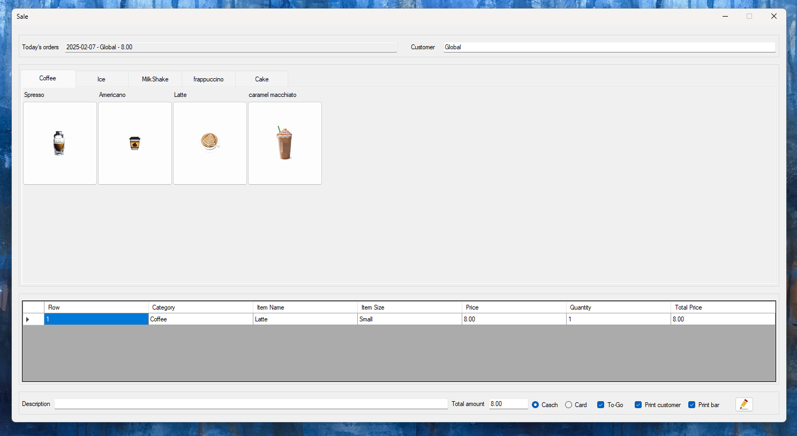
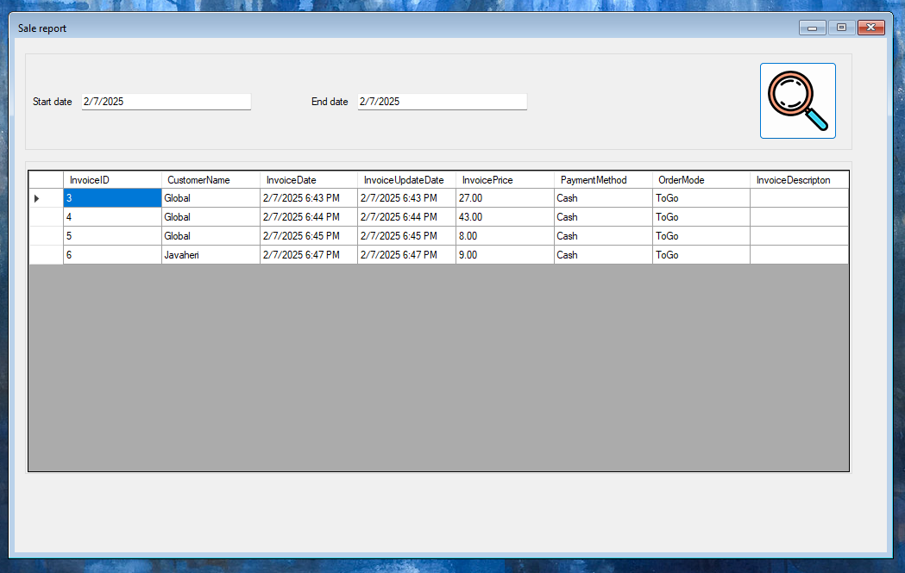
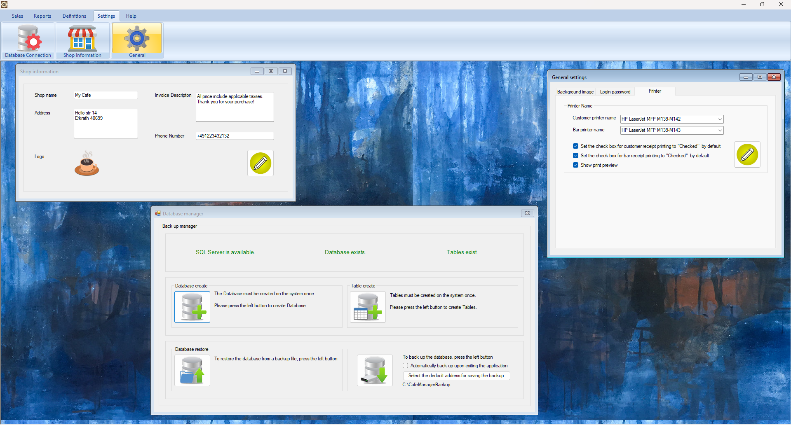
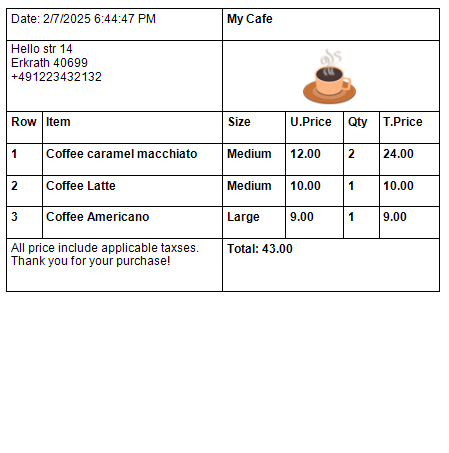

# Cafe & Restaurant Management System  

## 📌 Notice: Sample Code for Demonstration Only  
This repository contains **sample code** for my portfolio. It is **not intended for commercial use**.  
For inquiries, please contact me at mahan@javaheri.work  

A **Windows-based** management system designed for cafés and restaurants to efficiently handle orders, sales, reporting, and invoicing. The system operates **offline** and supports **synchronization with an online platform**.

## Features  
✅ **Order & Sales Management** – Manage customer orders and track sales efficiently.  
✅ **Reporting & Analytics** – Generate detailed reports on daily, weekly, and monthly sales.  
✅ **Invoice & Receipt Printing** – Issue receipts with customizable templates.  
✅ **Multi-User Support** – Manage different user roles with access control.  
✅ **Offline Support** – Works independently without an internet connection.  
✅ **Database Synchronization** – Optionally sync menu data with the **leackerdeal.de** website.  
✅ **PayPal Payment Integration** – Planned for future implementation.  

## Technologies Used  
- **C# (.NET Framework)** – Core programming language  
- **Windows Forms (WinForms)** – UI framework for desktop application  
- **MSSQL (Local Database)** – Database system with stored procedures  
- **ADO.NET** – Direct database communication  
- **Microsoft Dependency Injection (DI)** – Used for managing services  
- **Layered Architecture (BEL, BAL, DAL)** – Structured to separate business logic, database access, and UI processing  

## Project Architecture  
The system follows a **layered architecture** for better maintainability and scalability:

### **1. Business Entities Layer (BEL)**  
Defines the **data models** used across the application. Examples:  
- `Invoice.cs` – Stores invoice details  
- `InvoiceItem.cs` – Manages ordered products  
- `Settings.cs` – Stores application settings  

### **2. Business Application Layer (BAL)**  
Handles **business logic** and communicates with **DAL**. Examples:  
- `CafeMenuCategoryService.cs` – Manages menu categories  
- `SettingsService.cs` – Handles system settings  

### **3. Data Access Layer (DAL)**  
Manages **database operations (CRUD)** using ADO.NET and stored procedures. Examples:  
- `InvoiceRepository.cs` – Handles invoice-related database queries  
- `SettingsRepository.cs` – Manages application settings in the database  

## Installation & Setup  
1. Clone the repository:  
   ```sh  
   git clone https://github.com/mahan-developer/CafeManagementSystem.git  
   ```  
2. Open the solution in **Microsoft Visual Studio 2022**.  
3. Ensure that **SQL Server Express (SQLEXPRESS)** is installed on your system.  
4. Build and run the application.  

## Screenshots  
 
 
 
 
 
 

## Upcoming Features  
🚀 **Small Accounting System** – Track café expenses, sales, and profit calculations.  
🚀 **Purchase Management** – Keep track of café purchases and stock.  
🚀 **Menu Upload to Website** – Sync menu items to **leackerdeal.de** once the database is ready.  

## Contribution & License  
This project is currently under development and is not open-source for commercial use. Please refer to the **LICENSE** file for more details. For inquiries, please contact the repository owner.

